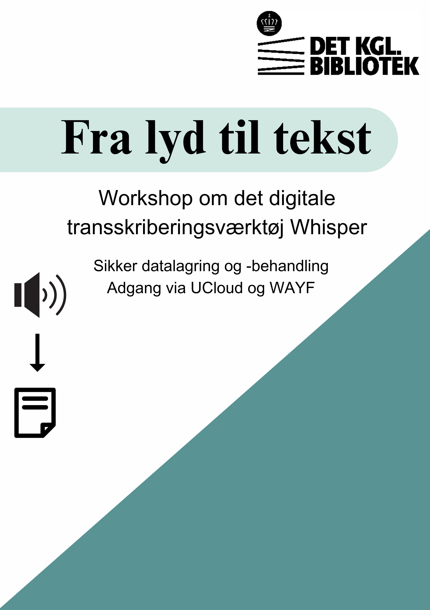

# Workshop: Whisper
## Introduction
This repository contains the material for the Whisper (transcription) workshop from AU Library at the Royal Danish Library. The purpose of the workshop is to use a digital tool to transform sound into text. The workshop focuses on OpenAI's Whisper model hosted in UCloud by SDU (Syddansk Universitet). In addition, the workshop will focus on best practices in relation to both transcription and the use of digital tools for data processing.
There are no expectations for previous experience with transcription, digital tools or UCloud.

## Workshop
There will be a hands-on exercise where participants can try Whisper. It will be possible to practice with a test audio file that can be found in the Data folder. It is therefore not a requirement to have a audio file available in order to participate

## Data
The data for the workshop consists of a short audio file, which is transformed into text using the digital transcription tool, Whisper. The audio file is created specifically for this purpose and based on the principle of stress-testing the transcription tool. This way, participants can gain insight into how Whisper works (when it transcribes correctly and when errors occurs). The audio file contains a staged focus group interview where the respondents have been instructed to interrupt each other. Additionally, the recording is made in a location with a lot of background noise. As the final element of the stress test, the majority of the respondents speak Danish, but one of the respondents speaks Norwegian. These are all elements we have been aware of to see how the tool performs under somewhat chaotic conditions.

