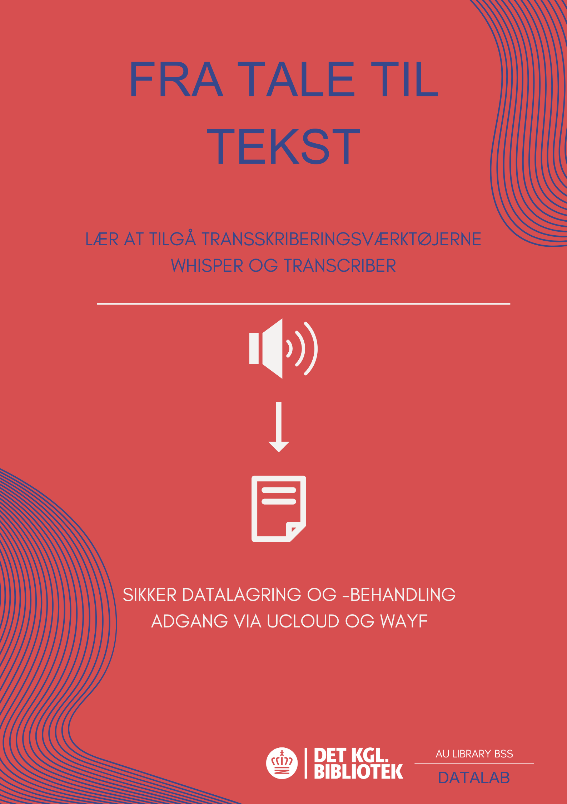

# Fra Tale Til Tekst
English below
## Introduktion
Dette repository indeholder materialet til transskriberingsworkshoppen (Fra Tale til Tekst) udarbejdet af AU Library ved Det Kgl. Bibliotek. Formålet med workshoppen er at anvende digitale værktøjer til at transformere lyd om til tekst. Workshoppen beskæftiger sig med OpenAI's Whisper model, der hostes i UCloud. Derudover fokuserer workshoppen på best practices i forbindelse med bådde transskribering og anvendelsen af digitale værktøjer til databearbejdelse. Det er ingen krav for eller forventning om tidligere erfaring med hverken transskribering, digitale værktøjer eller UCloud i forbindelse med deltagelse i workshoppen.

## Workshop
Workshoppen indeholder blandt andet en hands-on øvelse, hvor deltagere kan prøve kræfter med Whisper og Transcriber. Det er muligt at anvende en test lydfil i workshoppen. Denne kan findes i Data mappen. Det er derfor ikke et krav for deltagelse, at man har en lydfil til rådighed. 

## Data
Dataen til workshoppen består af en kort lydfil, der transformers om til tekst ved hjælp af et digitalt transskriberingsværktøj (Whisper eller Transcriber). Lydfilen er optaget specifikt til formålet og baserer sig på et ønske om at stress-teste transskriberingsværktøjerne. På den måde kan deltagere i workshoppen få indsigt i, hvordan værktøjerne fungerer - hvornår lyd bliver transskriberet korrekt, og hvornår (og hvorfor), der opstår fejl. Lydfilen består af et opstillet fokusgruppeinterview, hvor respondenterne er blevet instrueret i at tale i munden på hinanden og afbryde. Derudover finder selve optagelsen sted i et lokale med en masse baggrundsstøj. Sidst men ikke mindst består sidste del af stress-testen af, at hovedparten af respondenterne taler dansk, men en respondent taler norsk. Dette er alle elementer vi har været klar over og bevidste om i forbindelse med at teste, hvordan værktøjerne performer under de meget ugunstige forhold. 

# From Speech to Text
## Introduction
This repository contains the material for the transcription workshop from AU Library at the Royal Danish Library. The purpose of the workshop is to use a digital tool to transform sound into text. The workshop focuses on OpenAI's Whisper model hosted in UCloud. In addition, the workshop will focus on best practices in relation to both transcription and the use of digital tools for data processing.
There are no expectations for previous experience with transcription, digital tools or UCloud.

## Workshop
There will be a hands-on exercise where participants can try Whisper and Transcriber. It will be possible to practice with a test audio file that can be found in the Data folder. It is therefore not a requirement to have a audio file available in order to participate

## Data
The data for the workshop consists of a short audio file, which is transformed into text using the digital transcription tool (Whisper or Transcriber). The audio file is created specifically for this purpose and based on the principle of stress-testing the transcription tool. This way, participants can gain insight into how Whisper works (when it transcribes correctly and when errors occurs). The audio file contains a staged focus group interview where the respondents have been instructed to interrupt each other. Additionally, the recording is made in a location with a lot of background noise. As the final element of the stress test, the majority of the respondents speak Danish, but one of the respondents speaks Norwegian. These are all elements we have been aware of to see how the tool performs under somewhat chaotic conditions.

